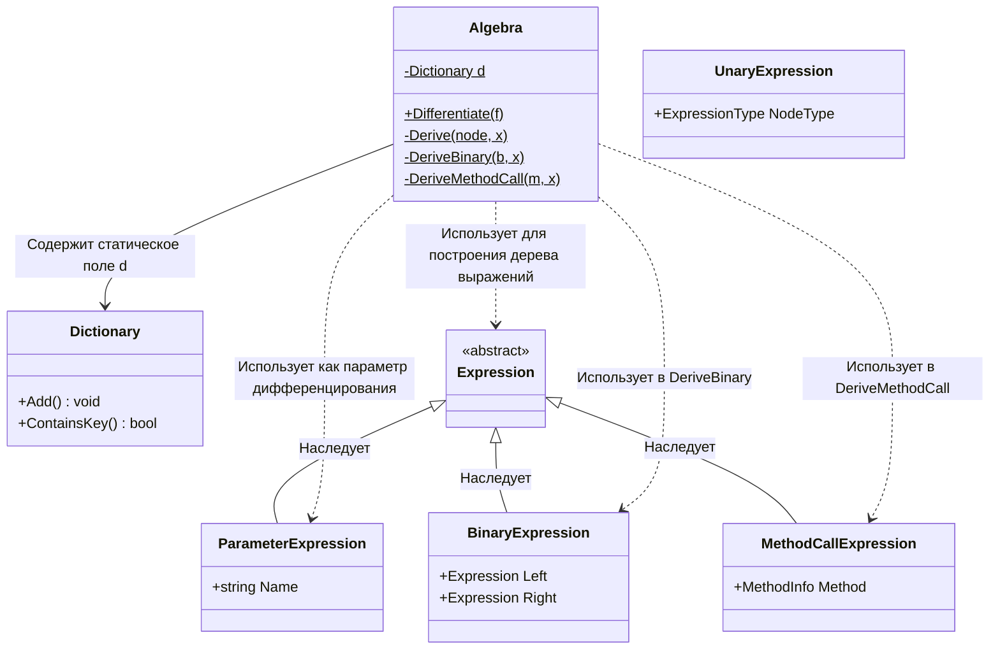

# Практика: Дифференцирование

## 1. Описание предметной области и сущностей
*В системе реализовано символьное дифференцирование математических выражений. Algebra - класс, предоставляющий метод Differentiate для преобразования выражения функции в ее производную. Expression - абстрактный класс, представляющий узел дерева выражения. ParameterExpression - параметр функции. ConstantExpression - константное значение. BinaryExpression - бинарная операция. MethodCallExpression - вызов математической функции. UnaryExpression - унарная операция. Func<double, double> - делегат функции одной переменной. Dictionary<string, Func<Expression, Expression>> - словарь, сопоставляющий имя функции делегату, строящему выражение ее производной.*

## 2. Диаграмма классов (Mermaid)

