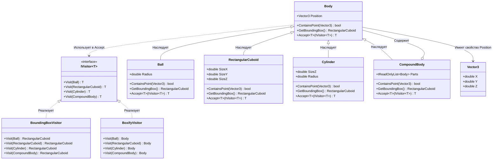

# Практика: Геометрия-2

## 1. Описание предметной области и сущностей
*В системе моделируются трехмерные геометрические тела. IVisitor<T> - интерфейс посетителя, позволяющий выполнять различные операции над иерархией тел без изменения их классов. Body определяет базовое тело с положением в пространстве. Ball - шар с радиусом. RectangularCuboid - прямоугольный параллелепипед с размерами по трем осям. Cylinder - цилиндр с радиусом и высотой. CompoundBody - составное тело, содержащее список других тел. BoundingBoxVisitor - посетитель, вычисляющий параллелепипед для любого тела. BoxifyVisitor - посетитель, заменяющий каждое тело его параллелепипедом. Vector3 - структура для хранения координат точки или вектора в трехмерном пространстве.*

## 2. Диаграмма классов (Mermaid)

