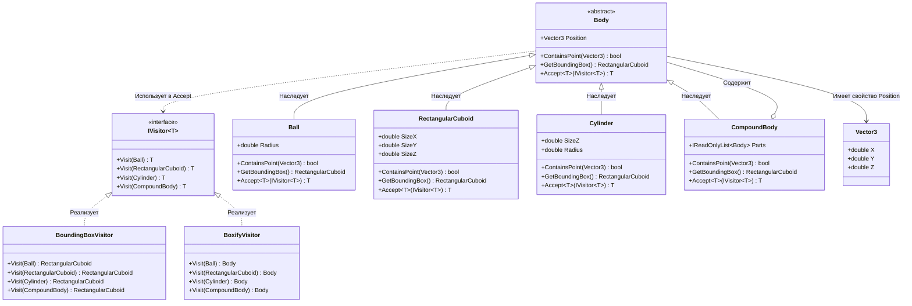

```mermaid
classDiagram
    direction TB

    class IVisitor~T~ {
        <<interface>>
        +Visit(Ball) T
        +Visit(RectangularCuboid) T
        +Visit(Cylinder) T
        +Visit(CompoundBody) T
    }

    class Body {
        <<abstract>>
        +Vector3 Position
        +ContainsPoint(Vector3) bool
        +GetBoundingBox() RectangularCuboid
        +Accept~T~(IVisitor~T~) T
    }

    class Ball {
        +double Radius
        +ContainsPoint(Vector3) bool
        +GetBoundingBox() RectangularCuboid
        +Accept~T~(IVisitor~T~) T
    }

    class RectangularCuboid {
        +double SizeX
        +double SizeY
        +double SizeZ
        +ContainsPoint(Vector3) bool
        +GetBoundingBox() RectangularCuboid
        +Accept~T~(IVisitor~T~) T
    }

    class Cylinder {
        +double SizeZ
        +double Radius
        +ContainsPoint(Vector3) bool
        +GetBoundingBox() RectangularCuboid
        +Accept~T~(IVisitor~T~) T
    }

    class CompoundBody {
        +IReadOnlyList~Body~ Parts
        +ContainsPoint(Vector3) bool
        +GetBoundingBox() RectangularCuboid
        +Accept~T~(IVisitor~T~) T
    }

    class BoundingBoxVisitor {
        +Visit(Ball) RectangularCuboid
        +Visit(RectangularCuboid) RectangularCuboid
        +Visit(Cylinder) RectangularCuboid
        +Visit(CompoundBody) RectangularCuboid
    }

    class BoxifyVisitor {
        +Visit(Ball) Body
        +Visit(RectangularCuboid) Body
        +Visit(Cylinder) Body
        +Visit(CompoundBody) Body
    }

    class Vector3 {
        +double X
        +double Y
        +double Z
    }

    IVisitor~RectangularCuboid~ <|.. BoundingBoxVisitor : Реализует
    IVisitor~Body~ <|.. BoxifyVisitor : Реализует

    Body <|-- Ball : Наследует
    Body <|-- RectangularCuboid : Наследует
    Body <|-- Cylinder : Наследует
    Body <|-- CompoundBody : Наследует

    CompoundBody o-- Body : Содержит
    Body --> Vector3 : Имеет свойство Position
    Body ..> IVisitor~T~ : Использует в Accept
```
