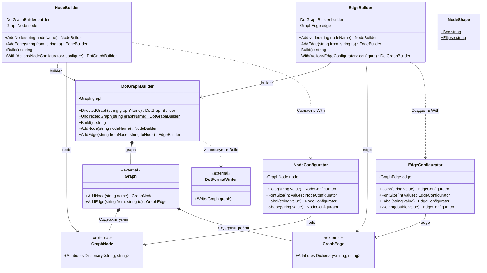

# Практика: GraphViz

## 1. Описание предметной области и сущностей
*В системе реализован построитель графов в формате DOT для визуализации с помощью Graphviz. DotGraphBuilder - основной класс, предоставляющий фасад для создания ориентированных и неориентированных графов. Graph - класс, представляющий граф, содержащий коллекции узлов и ребер. GraphNode - узел графа, имеющий атрибуты. GraphEdge - ребро графа, соединяющее два узла и имеющее атрибуты. NodeBuilder - построитель узлов, предоставляющий методы для добавления новых узлов и ребер, а также конфигурации текущего узла через метод With. EdgeBuilder - построитель ребер, предоставляющий методы для добавления новых узлов и ребер, а также конфигурации текущего ребра через метод With. NodeConfigurator - класс для настройки атрибутов узла в DSL. EdgeConfigurator - класс для настройки атрибутов ребра в DSL. DotFormatWriter - класс, отвечающий за сериализацию графа в DOT формате. NodeShape - статический класс с константами для определения формы узлов.*

## 2. Диаграмма классов (Mermaid)

