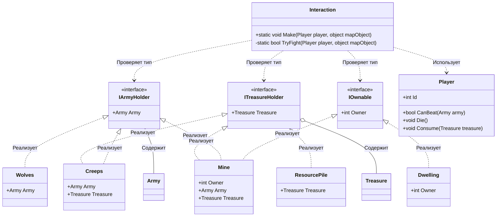

# Практика: HoMM

## 1. Описание предметной области и сущностей
*В системе моделируется взаимодействие игрока с объектами на игровой карте. Интерфейсы IArmyHolder, ITreasureHolder и IOwnable определяют роли объектов: наличие армии, сокровищ и владельца. Player - игрок, который может победить армию, умереть и получить сокровища. Army - армия для защиты объектов. Treasure - сокровища. Dwelling - жилище. Mine - шахта, реализует все три интерфейса. Creeps - монстры, имеют армию и сокровища. Wolves - волки, имеют только армию. ResourcePile - куча ресурсов. Interaction - статический класс с методом Make, который управляет взаимодействием во всей игре. Он проверяет тип объекта через интерфейсы, вызывает TryFight для проверки боя и в зависимости от результата игрок либо умирает, либо забирает сокровища и захватывает объект.*

## 2. Диаграмма классов (Mermaid)

