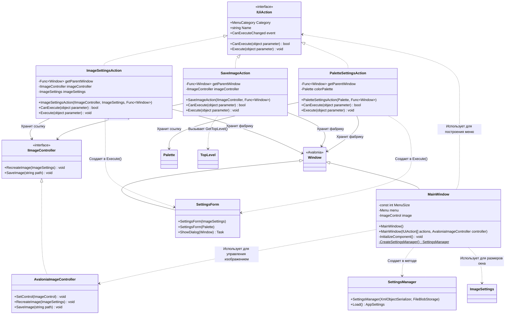

# Практика: Fractal Painter. DIP

## 1. Описание предметной области и сущностей
*В системе реализован графический редактор для генерации и сохранения фрактальных изображений с настраиваемыми параметрами отрисовки. Основными сущностями являются действия пользовательского интерфейса, реализующие команды настройки изображения, палитры и сохранения результата. MainWindow выступает главным контейнером приложения, управляющим отображением меню и области визуализации через элементы Avalonia UI. ImageSettingsAction управляет параметрами изображения, используя IImageController для пересоздания холста при изменении настроек. PaletteSettingsAction предоставляет интерфейс для настройки цветовой палитры, влияющей на визуальное представление фракталов. SaveImageAction обеспечивает сохранение сгенерированного изображения в файловую систему. ImageController инкапсулирует логику работы с графическим контекстом, включая отрисовку на элементе ImageControl и экспорт в файл. Взаимодействие между действиями и окнами организовано через Func<Window>, обеспечивающую получение текущего родительского окна для отображения диалоговых окон настроек. SettingsManager через XmlObjectSerializer и FileBlobStorage отвечает за загрузку сохраненных параметров приложения из внешнего хранилища.*

## 2. Диаграмма классов (Mermaid)

