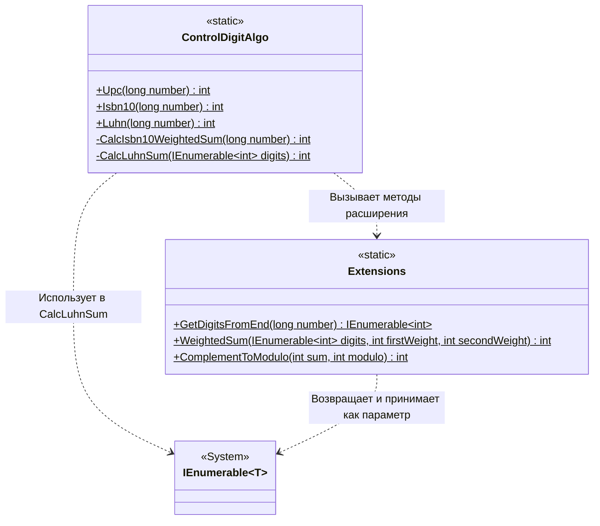

# Практика: Контрольный разряд

## 1. Описание предметной области и сущностей
*В системе реализованы алгоритмы вычисления контрольных цифр для различных стандартов. ControlDigitAlgo - класс, предоставляющий методы для расчета контрольных цифр по алгоритмам UPC, ISBN-10 и Luhn. Extensions - класс с методами расширения, обеспечивающими вспомогательные операции. IEnumerable<int> - интерфейс, представляющий последовательность цифр числа.
Метод GetDigitsFromEnd преобразует целое число в последовательность его цифр, начиная с младшего разряда. WeightedSum вычисляет сумму произведений цифр на чередующиеся весовые коэффициенты. ComplementToModulo находит число, которое необходимо добавить к сумме для получения значения, кратного заданному модулю.
Алгоритм UPC использует весовые коэффициенты 3 и 1, чередующиеся с младшего разряда, и вычисляет контрольную цифру как дополнение суммы до 10. Алгоритм ISBN-10 использует возрастающие веса от 2 до 10, начиная с младшего разряда, и вычисляет контрольную цифру как дополнение суммы до 11, с возможным значением 'X' для контрольной цифры 10. Алгоритм Luhn применяет удвоение каждой второй цифры с младшего разряда и замену чисел больше 9 на сумму их цифр, после чего вычисляет контрольную цифру как дополнение суммы до 10.*

## 2. Диаграмма классов (Mermaid)

