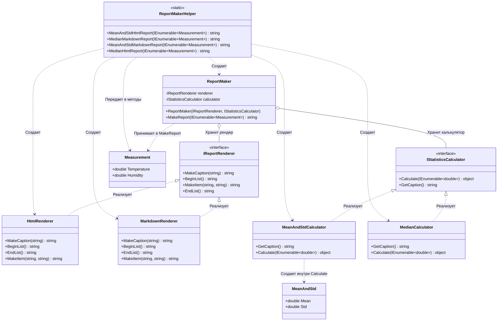

# Практика: Генератор отчетов

## 1. Описание предметной области и сущностей
*В системе моделируется генерация отчетов о погодных измерениях. IReportRenderer - интерфейс для форматирования отчета, определяющий методы создания заголовка, начала списка, элемента списка и конца списка. IStatisticsCalculator - интерфейс для вычисления статистических показателей, позволяющий получить название статистики и рассчитать ее по набору данных. HtmlRenderer - рендерер, который форматирует отчет в HTML с тегами h1, ul и li. MarkdownRenderer - рендерер, который форматирует отчет в Markdown с заголовками второго уровня и маркированными списками. MeanAndStdCalculator - калькулятор, вычисляющий среднее арифметическое и стандартное отклонение выборки. MedianCalculator - калькулятор, вычисляющий медиану выборки. ReportMaker - класс, который комбинирует рендерер и калькулятор для создания готового отчета. ReportMakerHelper - статический вспомогательный класс, предоставляющий методы для создания конкретных типов отчетов. Measurement - сущность, хранящая результаты одного измерения: температуру и влажность воздуха.*

## 2. Диаграмма классов (Mermaid)

