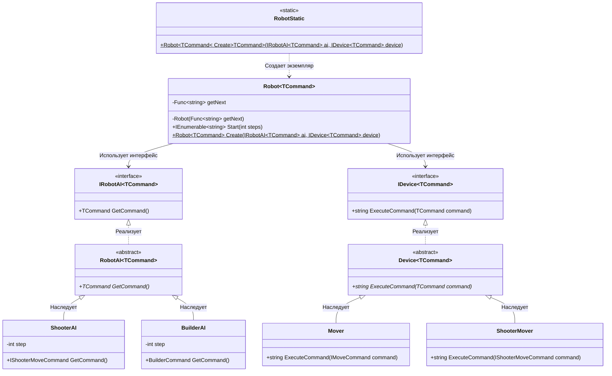

# Практика: Роботы

## 1. Описание предметной области и сущностей
*В системе моделируются роботы с искусственным интеллектом, выполняющие команды. IRobotAI<TCommand> - интерфейс ИИ робота, определяющий получение команды. RobotAI<TCommand> - класс для всех ИИ роботов. ShooterAI - ИИ стрелка, который с каждым шагом увеличивает step и возвращает команду движения с стрельбой. BuilderAI - ИИ строитель, который с каждым шагом увеличивает step и возвращает строительную команду. IDevice<TCommand> - интерфейс устройства, исполняющего команды. Device<TCommand> - класс для устройств. Mover - устройство, исполняющее команды движения. ShooterMover - устройство стрелка, исполняющее команды движения с стрельбой. Robot<TCommand> - робот, объединяющий ИИ и устройство, запускающий выполнение команд на определенное количество шагов и возвращающий результаты. RobotStatic - статический класс для создания роботов любого типа.*

## 2. Диаграмма классов (Mermaid)

