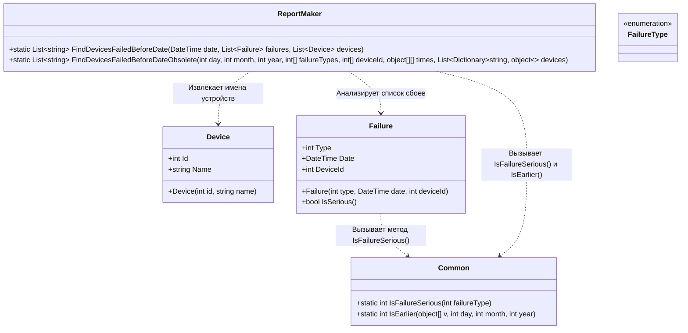

```mermaid
classDiagram
direction TB
    class Device {
	    +int Id
	    +string Name
	    +Device(int id, string name)
    }

    class Failure {
	    +int Type
	    +DateTime Date
	    +int DeviceId
	    +Failure(int type, DateTime date, int deviceId)
	    +bool IsSerious()
    }

    class Common {
	    +static int IsFailureSerious(int failureType)
	    +static int IsEarlier(object[] v, int day, int month, int year)
    }

    class ReportMaker {
	    +static List~string~ FindDevicesFailedBeforeDate(DateTime date, List~Failure~ failures, List~Device~ devices)
	    +static List~string~ FindDevicesFailedBeforeDateObsolete(int day, int month, int year, int[] failureTypes, int[] deviceId, object[][] times, List~Dictionary~string, object~~ devices)
    }

    class FailureType {
    }

	<<enumeration>> FailureType

    Failure ..> Common : Вызывает метод IsFailureSerious()
    ReportMaker ..> Failure : Анализирует список сбоев
    ReportMaker ..> Device : Извлекает имена устройств
	ReportMaker ..> Common : Вызывает IsFailureSerious() и IsEarlier()
```
