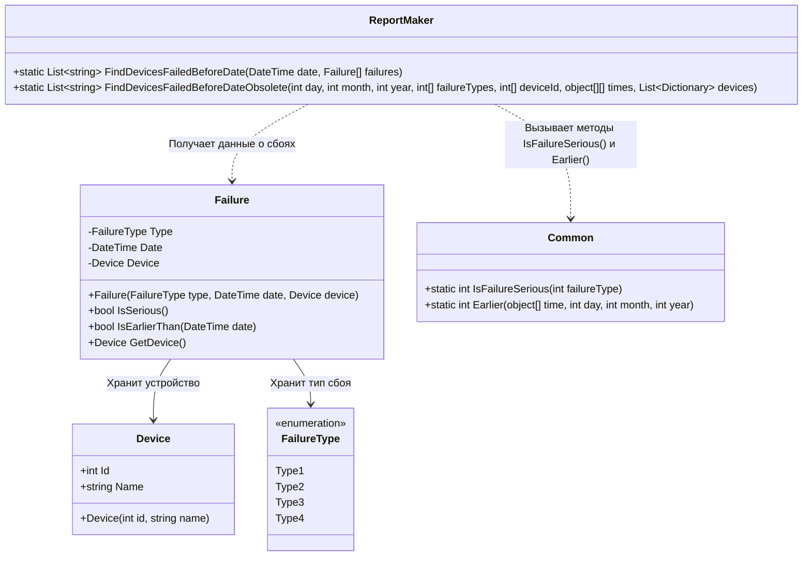

# Практика: Сбои

## 1. Описание предметной области и сущностей
*В системе хранится информация об устройствах и зафиксированных на них сбоях. Device - отвечает за хранение информации об устройстве. Failure - фиксирует сбой. FailureType - тип сбоев. Common - класс, содержащий методы для общих операций. ReportMaker - основной класс для генерации отчетов. ReportMaker берет список сбоев и список устройств. Он проверяет каждый сбой, если сбой серьезный и случился до нужной даты, то ReportMaker находит устройство по его номеру и запоминает название этого устройства.*

## 2. Диаграмма классов (Mermaid)

