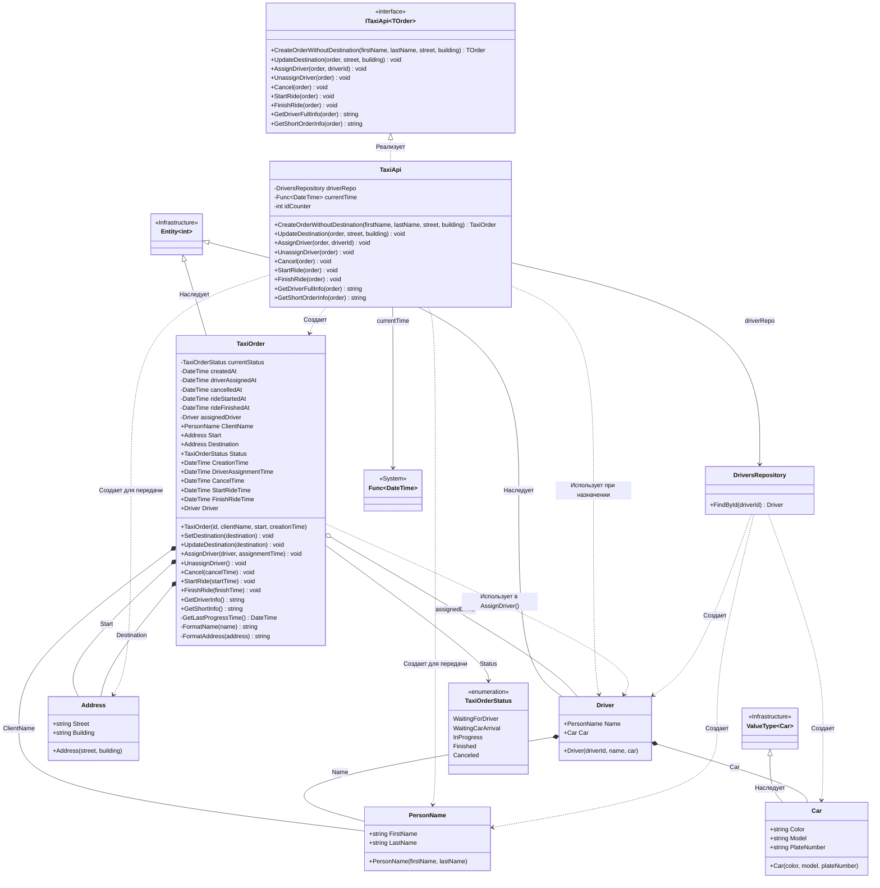

# Практика: TaxiOrder

## 1. Описание предметной области и сущностей
*В системе реализовано управление заказами такси. TaxiApi - основной класс, предоставляющий API для создания и управления заказами такси. TaxiOrder - агрегатный корень, представляющий заказ такси. Driver - сущность, представляющая водителя такси с закрепленным автомобилем. Car - объект, описывающий автомобиль. PersonName - объект, хранящее имя и фамилию клиента или водителя. Address - объект, описывающий адрес. DriversRepository - репозиторий для поиска водителей по идентификатору. TaxiOrderStatus - перечисление, определяющее состояния заказа: WaitingForDriver (ожидание водителя), WaitingCarArrival (ожидание прибытия авто), InProgress (в пути), Finished (завершен), Canceled (отменен). ITaxiApi<TOrder> - интерфейс, определяющий контракт для работы с заказами такси. Entity<TId> и ValueType<T> - классы инфраструктуры для сущностей и объектов-значений.*

## 2. Диаграмма классов (Mermaid)

